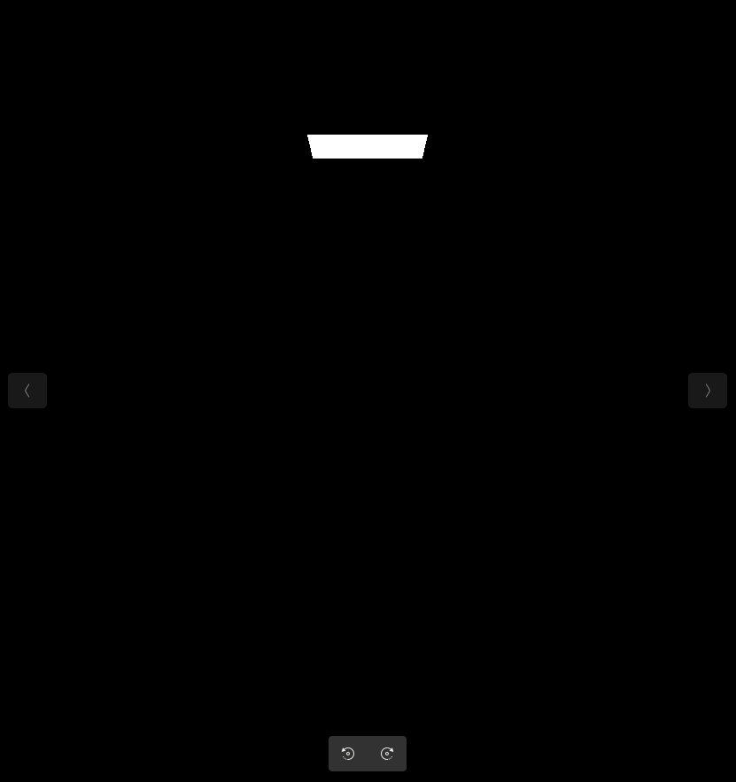
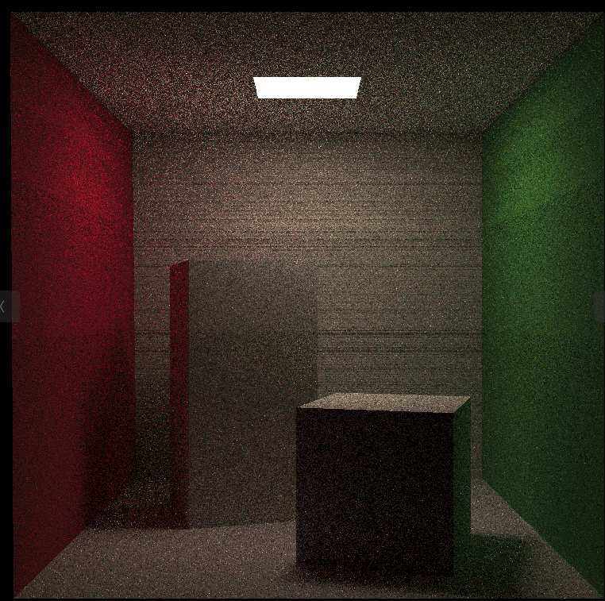
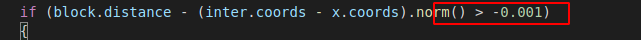
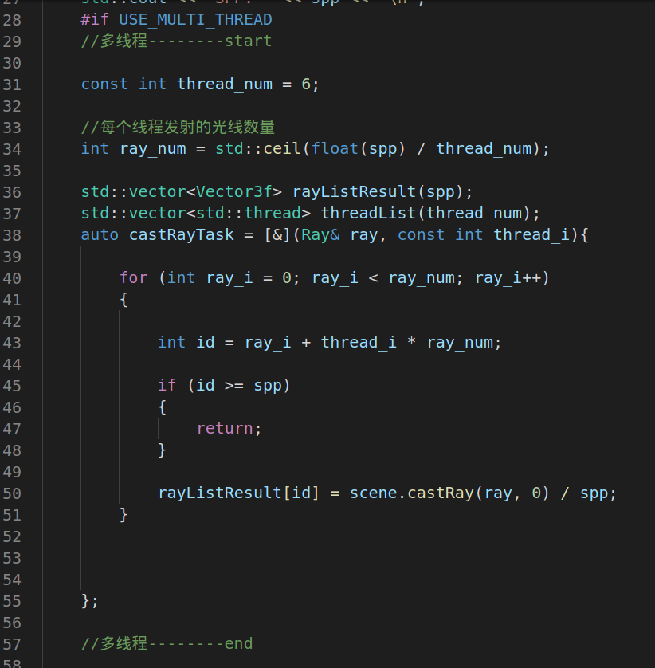

问题一： 只有灯光

遮挡判断方式错误， 原方式使用了对光源采样时，光源上的交点的distance, 但框架中只更新了位置和法线， 没有更新distance

问题二：黑色横纹,亮度不够

部分直接光由于精度问题，被错误判断为遮挡。通过精度调整放宽相交限制。

原使用的精度为 const float EPSILON = 0.00001; 

修改后 

问题三： 简单的多线程实现

开启指定个数进程， 每个进程平均分配spp发射发射光线数量

